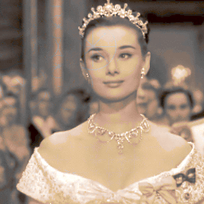

# ADS Project 5: 

Term: Spring 2018

+ Team 10
+ Projec title: Color Me: Colorize Grayscale Image
+ Team members
	+ Zhu, Qianli qz2310@columbia.edu (Presenter)
	+ Li, Hongyu hl3099@columbia.edu
	+ Huang, Yuexuan yh2966@columbia.edu
	+ Yang, Fan fy2232@columbia.edu
	+ Zheng, Jia jz2891@columbia.edu
	
+ Project summary: Photo always records a memorable moment for us. Lots of valuable photos which shot long time ago are black and white. In this project, we used machine learning techiniques (CNN, SVM, GBM and Xgboost) to colorize black-and-white images, using a colormap selected from a similar training image. 


 ; 

**Contribution statement**: ([default](doc/a_note_on_contributions.md)) All team members contributed equally in all stages of this project. All team members approve our work presented in this GitHub repository including this contributions statement. 

 + **Zhu, Qianli**: 
 
 + **Li, Hongyu**: Hongyu Li is responsible for Xgboost model. Got color map by using kmeans. Built SVM model for each color to predict labels of pixels for each image. Built Xgboost model to predict labels of pixels for each image.   
 
 + **Huang, Yuexuan**:  Yuexuan Huang is responsible for GBM model. Calculated K-means based color map for train_image and get their labels. Extracted HOG and DAISY features from images. Predicted image color by GBM. Organized github files and edited readme.
 
 + **Zheng, Jia**: 
 
 + **Yang, Fan**: 
 
  References used: 
1. Kabir zadeh Sousa Blaes - Automatic Colorization Of Grayscale Images
2. Deshpande, Aditya, et al. ???Learning Large-Scale Automatic Image Colorization.???Http://Vision.cs.illinois.edu/Projects/Lscolor/, 2015, www.bing.com/cr?IG=6B02F6641D5E4031BC11DA38D3088C94&CID=251B462EF8D16B7116D44DF2F97E6A82&rd=1&h=dTjkRAib9tO5pMcu443bwSJf5e5e-7HRyxu8rBnroDc&v=1&r=https%3a%2f%2fwww.cv-foundation.org%2fopenaccess%2fcontent_iccv_2015%2fpapers%2fDeshpande_Learning_Large-Scale_Automatic_ICCV_2015_paper.pdf&p=DevEx.LB.1,5077.1
3. Iizuka, Satoshi, et al. ???Let There Be Color!: Joint End-to-End Learning of Global and Local Image Priors for Automatic Image Colorization with Simultaneous Classification.??? Let There Be Color!: Joint End-to-End Learning of Global and Local Image Priors for Automatic Image Colorization with Simultaneous Classification, 2016, hi.cs.waseda.ac.jp/~iizuka/projects/colorization/en/.

Following [suggestions](http://nicercode.github.io/blog/2013-04-05-projects/) by [RICH FITZJOHN](http://nicercode.github.io/about/#Team) (@richfitz). This folder is orgarnized as follows.

```
proj/
????????? lib/
????????? data/
????????? doc/
????????? figs/
????????? output/
```

Please see each subfolder for a README file.
